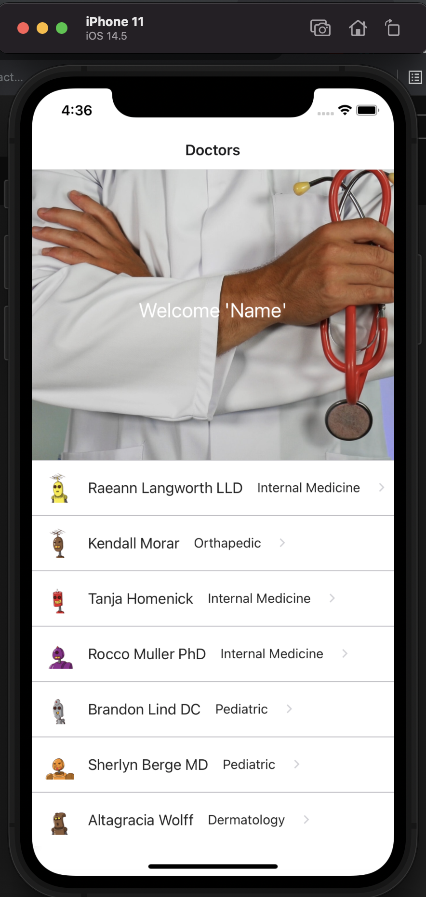

# my-records

This app allows user to manage their own medical records. User can keeps track and record their interactions with each of their doctors.

## Screenshots

## Technologies

- React Native
- Expo
- Ruby on Rails

## Getting Started

[Deployed Site](https://expo.io/@abdi-hu/projects/My-Doctors) |
[Backend Repo](https://github.com/abdi-hu/my_records_api)

### Planned Future Enhancements

- Calendar integration
- Login authentication
- Delete and update
- Adding Visits
- Pharmacy/medication reminders
